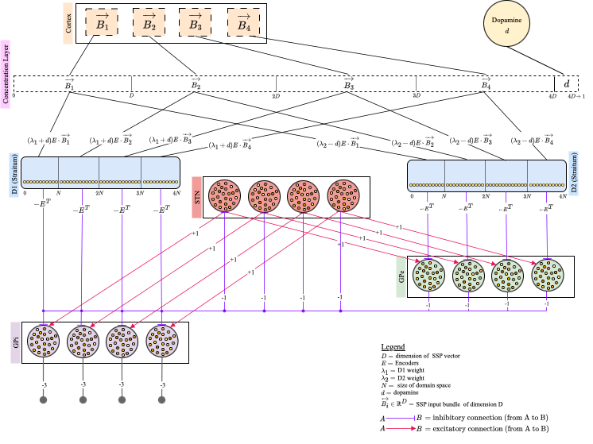

# Basal Ganglia

[A Computational Model of the Action Selection and Action Specification in the Basal Ganglia](https://escholarship.org/uc/item/2ct43100)

Status: Accepted to Cognitive Science Society 2026 \
Title: A Computation Model of Action Selection and Action Specification for the Basal Ganglia \
Submitted Date: February 2, 2026 \
Accepted Date: April 8, 2026 \
Published Date: 
Authors: **Priyadarshini Saha, Madeliene Bartlett, Jeff Orchard**


Presented as a Flash Talk in the  **Anuual Conference of the Cognitive Science Society 2026**

## Poster
Presented poster at **CogSci 2026** \
[Poster Available Here](./[Poster]%20Basal%20ganglia.pdf])


## Presentation Youtube Tutorial
Youtube Presentation Link: https://www.youtube.com/watch?v=7iUBRigqla4&t=5s&pp=0gcJCRoMAYcqIYzv

## Summary

This repository contains the implementation, data, and experiment scripts for a biologically inspired computational model of the basal ganglia that performs both **discrete action selection** and **continuous action specification** in a single operation.

The model addresses a gap in classical basal ganglia models, which typically treat the basal ganglia as a selector over discrete action channels—e.g., choosing *which* action to perform—but do not specify *how* the selected action should be executed along continuous dimensions such as force, speed, or movement vigor. Motivated by recent evidence that motor cortex and dorsal striatum jointly encode continuous action parameters, this work extends prior basal ganglia models by representing each candidate action as an action-salience distribution over a continuous parameter space.

The model uses high-dimensional Spatial Semantic Pointer/Vector Symbolic Architecture representations to encode action-salience distributions, and applies Dynamic Neural Field dynamics in the striatum to reduce entropy across the combined multi-action representation. This entropy-reduction transformation sharpens the input distribution while preserving its peak, allowing the model to identify both the winning action channel and the corresponding continuous action parameter.

In simulations patterned after the reach-to-pull paradigm, the model successfully:
- selects between multiple discrete action alternatives,
- specifies the continuous parameter value for the selected action,
- transforms high-entropy cortical action-salience bundles into low-entropy striatal/BG output representations,
- and demonstrates how a single cortico–basal-ganglia–thalamo–cortical mechanism can couple “what to do” with “how much” to do it.

Overall, this work proposes a mechanistic account of how the basal ganglia may jointly support action selection and action specification, extending localist channel-based models toward continuous, distributed representations of action parameters.

This model extends the action specification framework proposed by Bartlett et al. (2025), which introduced a basal ganglia model using Vector Symbolic Architectures to represent continuous action spaces and Dynamic Neural Fields to sharpen action-salience distributions. While Bartlett et al. focused on specification within a single action channel, the present model generalizes this approach across multiple discrete action channels, enabling joint action selection and continuous action specification in a unified basal ganglia circuit. 

Citation for Bartlett et al. (2025): Bartlett, M., Furlong, P. M., Stewart, T. C., & Orchard, J. (2025). *A Computational Model of Action Specification in the Basal Ganglia*. bioRxiv. https://doi.org/10.1101/2025.08.12.669938


## Requirements 
- Python==3.10.18
- gymnasium==1.0.0
- matplotlib==3.10.5
- nengo==4.1.0
- numpy==1.26.4
- scipy==1.16.1
- setuptools==80.9.0
- nengo_dft==0.0.1 (from https://github.com/tcstewar/nengo-dft/tree/main)
- sspspace==0.1 (from https://github.com/ctn-waterloo/sspspace)

**Note: See `requirements.txt`**

## Installation Instructions 

#### 1. Installing `nengo-dft` as a local package
- Clone the git repo:
  ```python
  git clone https://github.com/tcstewar/nengo-dft.git
  ```
- Change Director to the `nengo-dft1` repo:
  ```python
  cd nengo-dft
  ```
- Install the `nengo-dft` repository as a local package
  ```python
  pip install -e .
  ```
- Rename `nengo-dft` as `nengo_dft`

#### 2. Installing `sspspace` 
- Clone the git repo:
  ```python
  git clone https://github.com/ctn-waterloo/sspspace.git
  ```

#### 3. Running `requirements.txt`
- Make sure you are in the same folder as `requirements.txt`
- Run: `pip install -r requirements.txt`

## Model
Architecture of the Basal Ganglia model


## Documentation

Full documentation lives in the [`docs/`](docs/) folder.

### Core Model

| Document | Source file | Description |
|---|---|---|
| [`docs/bg_model.md`](docs/bg_model.md) | `bg_model.py`, `utility.py` | API reference for all classes and methods: `DNF`, `BasalGanglia`, `Utility`, `ActionIterator`, `DataStorage`. |
| [`docs/bg_model_demo.md`](docs/bg_model_demo.md) | `bg_model.ipynb` | Step-by-step walkthrough of the 4-action-channel demo — domain setup, SSP encoding, bundle construction, simulation, saving, and result plots. |

### Park Task Experiments

The Park Task tests BG action selection between two motor actions (Lever Pull vs. Button Press) over a continuous force domain `[0, 15]g`, using a 2×2 salience trial design.

| Document | Source file | Description |
|---|---|---|
| [`docs/park_task_unimodal.md`](docs/park_task_unimodal.md) | `park_task.ipynb` | Baseline experiment: one Beta distribution peak per action channel (unimodal). |
| [`docs/park_task.md`](docs/park_task.md) | `park_bimodal.ipynb` | Extended experiment: two peaks per channel (bimodal), testing selection under distributional ambiguity. |

## Citation
Saha, P., Bartlett, M., Orchard, J. (in press). _A Computational Model of Action Selection and Action Specification for the Basal Ganglia_. Proceedings of the 48th Annual Meeting of the Cognitive Science Society. https://escholarship.org/uc/item/2ct43100.

```bibtex
@inproceedings{saha2026basalganglia,
  author    = {Saha, Priyadarshini and Bartlett, Madeliene and Orchard, Jeff},
  title     = {A Computational Model of Action Selection and Action Specification for the Basal Ganglia},
  booktitle = {Proceedings of the 48th Annual Meeting of the Cognitive Science Society},
  year      = {2026},
  doi       = {[https://escholarship.org/uc/item/2ct43100](https://escholarship.org/uc/item/2ct43100)},
}
```

Note: XXXX to be replaced

## LICENSE
- GNU
