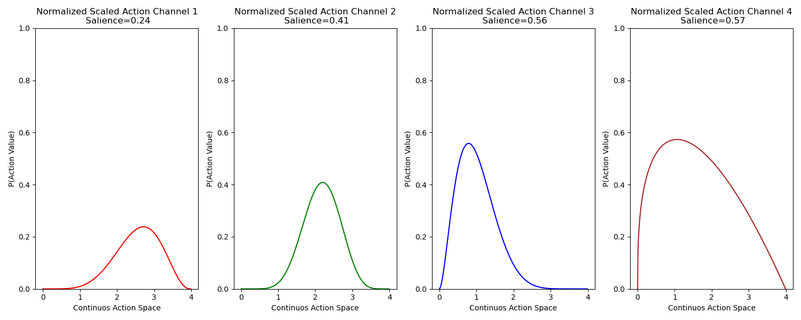
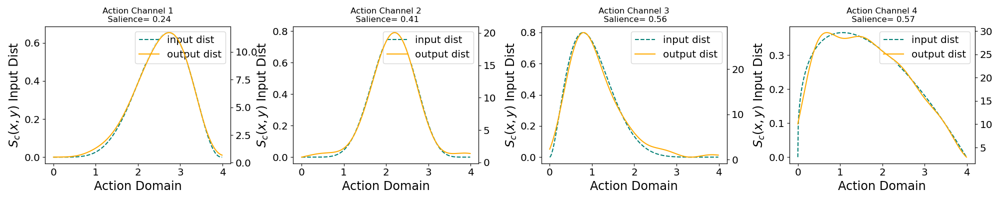
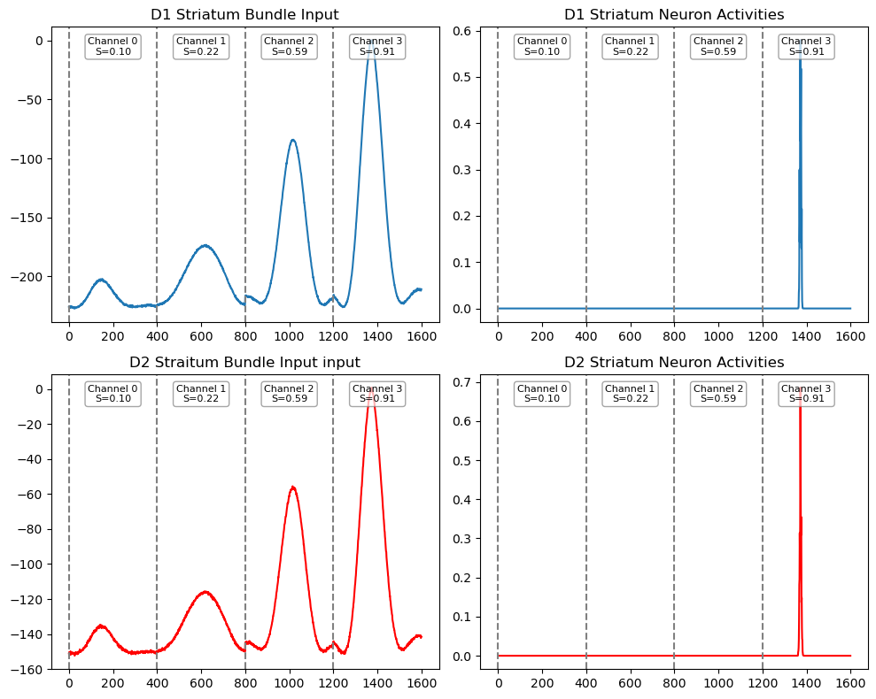
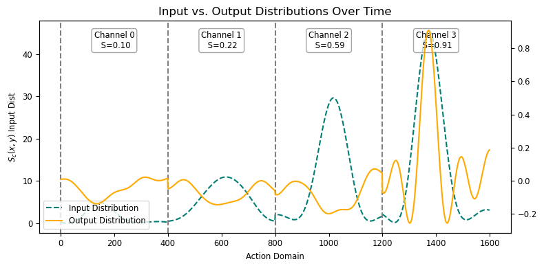

# `bg_model.ipynb` — Demo Walkthrough

This notebook demonstrates the full pipeline for building and simulating the Basal Ganglia model with multiple action channels. It is the primary reference for how to use [bg_model.py](../bg_model.py).

---

## Overview

The notebook runs a 4-action-channel BG simulation driven by randomly sampled Beta distributions over a continuous action domain `[0, 4]`. It saves probe data and produces three sets of plots.

---

## Step-by-Step Walkthrough

### 1. Domain & SSP Encoder Setup

```python
domain = np.arange(0, 4, 0.01).reshape(-1, 1)  # 400 points over [0, 4]

ssp_encoder = RandomSSPSpace(
    domain_dim=1,
    ssp_dim=512,
    rng=np.random.RandomState(),
    length_scale=0.5
)
domain_phis = ssp_encoder.encode(domain)  # Shape: (400, 512)
```

The continuous action domain is discretised into 400 points. `RandomSSPSpace` maps each scalar value to a 512-dimensional Spatial Semantic Pointer (SSP).

`domain_phis` (shape `400 × 512`) is the basis matrix used throughout the pipeline to bundle distributions into SSP vectors and to decode SSP vectors back into distributions.

**Place-cell encoders** for the Nengo ensembles:

```python
places_ = np.arange(low, high, width / domain.shape[0])
encoders = np.asarray(ssp_encoder.encode(places_.reshape(-1, 1))).squeeze()
# Shape: (400, 512)
```

These encoders project SSP vectors onto individual DNF neurons, one neuron per domain point.

---

### 2. Beta Distributions & Salience

```python
n_actions = 4
a_s = np.random.uniform(1, 10, size=n_actions)
b_s = np.random.uniform(1, 10, size=n_actions)

beta_distributions = [beta.pdf(domain, a_s[i], b_s[i], scale=domain[-1])
                      for i in range(n_actions)]

salience = np.random.uniform(0, 1, size=n_actions)
```

Each action channel gets an independently sampled Beta distribution over the force domain. Salience is a scalar weight in `[0, 1]` that will scale the distribution before encoding.

The notebook plots three versions of the distributions side by side:
1. **Raw** Beta PDFs
2. **Normalized** (peak = 1) via `Utility.to_normalize()`
3. **Salience-scaled** (normalized × salience) via `Utility.to_scale()`



---

### 3. DNF Parameters

```python
dnf_params = {
    'h'          : -3.009416816439706,
    'global_inh' :  8.641108231311897,
    'tau'         :  0.04706404390267922,
    'exc'         :  9.421285790349613,
    'inh'         :  1.4841093480380807,
    'exc_w'       :  8.534993467227224,
    'inh_w'       :  4.748154014869723,
    'dt'          :  0.001,
    'c_noise'     :  1.0,
    'shape'       : [(n_actions, 400)],
    'beta'        :  4,
}
```

These parameters define the excitatory-inhibitory balance in the DNF and were tuned for stable winner-take-all dynamics with 4 action channels of 400 neurons each. `shape` encodes the total neuron count as `n_actions × domain_size`.

---

### 4. Building the Input Bundle

```python
input_bundle = Utility.to_bundle(
    Utility.to_scale(salience, Utility.to_normalize(beta_distributions)),
    domain_phis=domain_phis
)
```

This one-liner chains three operations:
1. Normalize each distribution to peak = 1.
2. Scale by salience.
3. Encode as a 512D SSP bundle via weighted sum over `domain_phis`.

Result: a list of 4 vectors, each of shape `(512,)`.

---

### 5. Building & Running the Model

```python
bg_model = BasalGanglia(n_actions=n_actions, dnf_parameters=dnf_params, encoders=encoders)

data = bg_model.simulate(
    input_bundles=input_bundle,
    dopamine_level=0.2,
    presentation_time=1.5,
    duration=1.5
)
```

`data` is a dict with keys `bundle_ins`, `d1_input`, `d1_neuron`, `d2_input`, `d2_neuron`, `bundle_out`, `custom_probes`. See [bg_model.md](bg_model.md) for the full schema.

---

### 6. Saving Results

```python
ds = DataStorage()
npz_path = ds.save_npz(result, meta=meta, run_id='bg_model_1')
json_dir  = ds.save_json(result, meta=meta, run_id='bg_model_1')

loaded_npz, meta_npz = ds.load_npz(npz_path)
loaded_jsn, meta_jsn = ds.load_json(json_dir)
```

Both backends store all probe arrays and the distribution data added to `result`.

---

### 7. Plots

#### Input to BG Model (`./figures/bgmodel/bg_input.png`)

For each action channel, the plot shows the input SSP decoded back into the action domain (orange) overlaid on the original Beta distribution (teal, dashed). Salience is annotated in the title.

**Decoding** an SSP back into a distribution:
```python
seg_in = data['bundle_ins'][i][-1]            # 512D SSP at final timestep
inp_dec = np.einsum('d,nd->n', seg_in, domain_phis)  # shape: (400,)
```



#### D1 & D2 DNF Activities (`./figures/bgmodel/bg_dnf.png`)

2×2 grid showing:
- D1 input current and D1 firing rates
- D2 input current and D2 firing rates

Vertical grey dashed lines separate action channels. Each channel is labelled with its salience value.



#### Input vs. Output Distributions (`./figures/bgmodel/bg_output.png`)

All 4 action channels concatenated into a single plot with input (teal) and output (orange) on twin y-axes. Channel separators and salience annotations are shown. The output is decoded from `data['bundle_out']`:

```python
seg = data['bundle_out'][-1][i * 512 : (i + 1) * 512]
output_i = np.einsum('n,cn->c', seg, domain_phis)
```


