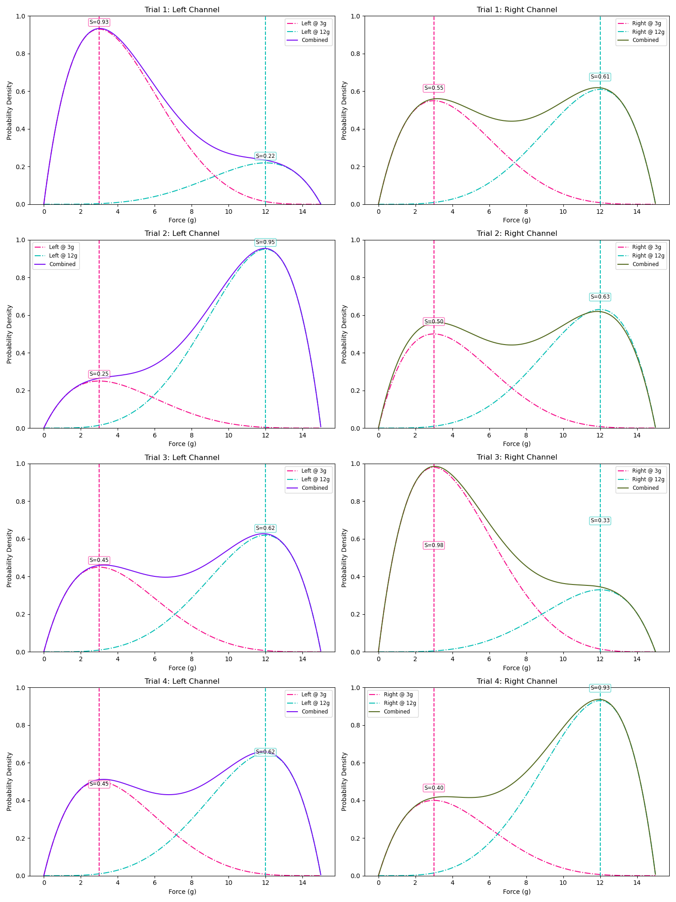
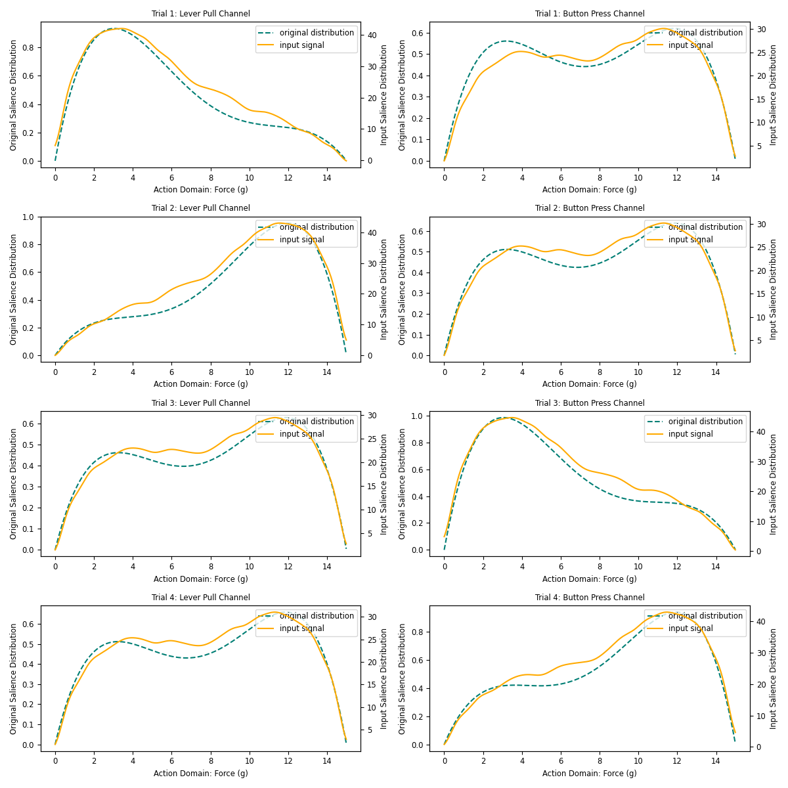
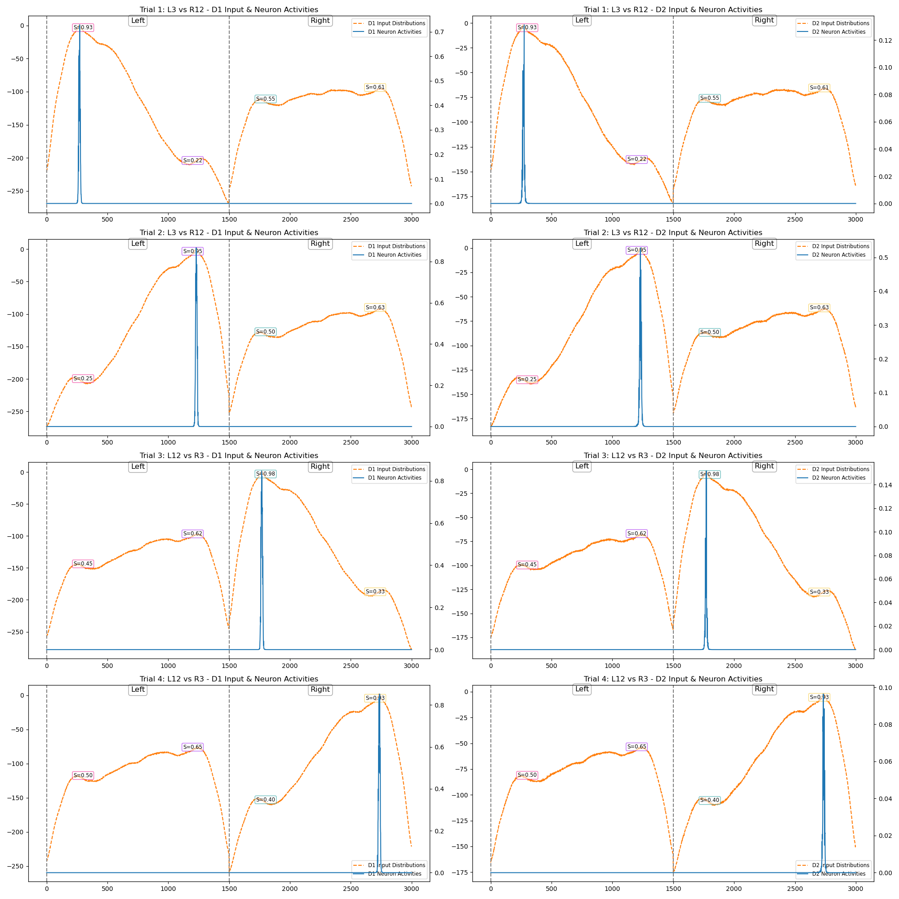
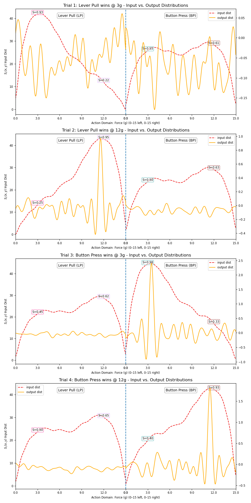
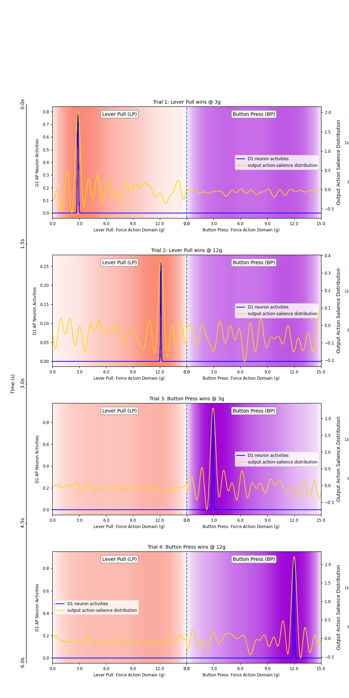

# Park Task — `park_bimodal.ipynb`

This notebook applies the Basal Ganglia model to a biomechanically motivated motor selection task called the **Park Task**. It tests whether the BG can correctly select between two competing motor actions when the salience distribution over a continuous kinematic parameter (force) is bimodal.

---

## Task Description

Two discrete motor actions are compared:

| Action | Discrete component | Continuous parameter (force domain: 0–15g) |
|---|---|---|
| **Lever Pull (LP)** | Pull left at +5° yaw | Peak force at **3g** |
| **Button Press (BP)** | Pull right at −15° yaw | Peak force at **12g** |

Each action channel has a **bimodal** distribution over the force domain `[0, 15]g` — two Beta PDF peaks merged into one bundle. This tests the model's ability to select across overlapping, ambiguous continuous representations.

---

## Experimental Design

A 2×2 factorial grid of trials, varying which action channel has higher salience:

| Trial | Left (LP) salience | Right (BP) salience | Expected winner |
|---|---|---|---|
| T1 | High (peak @ 3g) | Low (peak @ 12g) | LP wins @ 3g |
| T2 | Low (peak @ 3g) | High (peak @ 12g) | BP wins @ 12g |
| T3 | High (peak @ 12g) | Low (peak @ 3g) | LP wins @ 12g |
| T4 | Low (peak @ 12g) | High (peak @ 3g) | BP wins @ 3g |

---

## Step-by-Step Walkthrough

### 1. Domain & SSP Encoder

```python
n_actions_park = 2
domain_force_park = np.arange(0, 15, 0.01).reshape(-1, 1)  # 1500 points over [0, 15]g
ssp_dim_park = 512

ssp_encoder_park = RandomSSPSpace(
    domain_dim=1,
    ssp_dim=ssp_dim_park,
    rng=np.random.RandomState(0),
    length_scale=0.5
)
domain_phis_park = ssp_encoder_park.encode(domain_force_park)  # Shape: (1500, 512)
```

The force domain uses 1500 points (finer resolution than the base BG demo). The random seed is fixed at `0` for reproducibility.

---

### 2. Bimodal Distributions

Each action channel's input is a **bimodal** distribution created by summing two Beta PDFs:

- **Left channel**: `l3 + l12` — peaks at 3g and 12g
- **Right channel**: `r3 + r12` — peaks at 3g and 12g

```python
bimodal_distributions = np.concatenate(
    Utility.to_bimodal(Utility.to_scale(salience_t1, Utility.to_normalize(distributions))),
    axis=0
)
```

`Utility.to_bimodal()` takes a list of `2N` unimodal distributions and sums consecutive pairs to produce `N` bimodal distributions. For this task, `N = 2` (left and right channels).

The salience for each trial is set so that one channel dominates:

```python
# Trial 1: LP wins at 3g
salience_t1 = [high_salience_l3, high_salience_l12, low_salience_r3, low_salience_r12]
```

The per-trial salience-scaled bimodal distributions are shown below:



---

### 3. Saving Encoders

```python
np.savez('./bg_data/npz/park_bimodal/encoders.npz',
         ssp_encoder=ssp_encoder_park,
         dnf_encoders=dnf_encoders_park,
         domain_phis=domain_phis_park)
```

Encoders are saved separately so they can be reloaded for decoding results without re-running the SSP encoder.

---

### 4. Running Trials

A `trial()` helper function wraps `BasalGanglia` construction and simulation:

```python
def trial(bundles, n_actions, dnf_parameters, encoders,
          ssp_size=512, d1_weight=1.0, d2_weight=1.0, dopamine_level=0.2):
    bg_model = BasalGanglia(
        n_actions=n_actions,
        dnf_parameters=dnf_parameters,
        encoders=encoders
    )
    data = bg_model.simulate(
        input_bundles=bundles,
        dopamine_level=dopamine_level,
        presentation_time=1.5,
        duration=1.5
    )
    return data
```

Four trials are run:

```python
run_trial1 = trial(bundles_t1, ...)   # LP wins @ 3g
run_trial2 = trial(bundles_t2, ...)   # BP wins @ 12g
run_trial3 = trial(bundles_t3, ...)   # LP wins @ 12g
run_trial4 = trial(bundles_t4, ...)   # BP wins @ 3g
```

---

### 5. Saving Trial Data

```python
meta = {
    'model': 'basal_ganglia_2025_park_bimodal',
    'n_actions': 2,
    'domain': '[0, 15]',
    'domain_step': '0.01',
    'sim_time': 1.5,
    'dopamine_level': 0.2,
    ...
}
ds = DataStorage(base_dir='bg_data')
ds.save_npz(run_trial1, meta=meta, run_id='park_bimodal/trial1')
```

Data is stored under `./bg_data/npz/park_bimodal/trial{1..4}.npz`.

---

## Plots

### Input Bundle Plots vs. Original Beta Distributions

`plot_input_bundles()` generates one row per trial with one panel per action channel. Each panel shows:
- **Teal dashed**: the original Beta distribution (before encoding).
- **Orange solid**: the decoded SSP bundle recovered from `data['bundle_ins']`.

This verifies that the SSP encoding preserves the shape of the input distributions.



### D1 & D2 DNF Activity (`4×2 grid`)

For each trial (row) and each pathway (column):
- D1 DNF neuron activities for both action channels.
- D2 DNF neuron activities for both action channels.

Channel boundaries are marked with vertical lines; salience values are annotated. The winning channel should show a sharper, sustained peak in D1 and suppressed activity in D2.



### Input vs. Output Distributions (`4×2 grid`)

Decoded input and output SSPs plotted on twin y-axes for each trial and each channel. The BG output should **amplify** the winning channel's peak and **suppress** the losing channel's representation.



### Combined Visualisation (single-panel summary)

A global timeline plot stacking all four trials vertically, showing:
- DNF neuron activities (D1 & D2) per channel.
- Input and output decoded distributions.
- Trial labels and channel annotations.

Two colour-coded variants are produced with helper functions (`text_color_for_patch`, `scale_to_match`) for consistent visual presentation.



---

## Loading Saved Data

```python
data = np.load('./bg_data/npz/park_bimodal/encoders.npz', allow_pickle=True)
ssp_encoder_park = data['ssp_encoder']
dnf_encoders_park = data['dnf_encoders']
domain_phis_park = data['domain_phis']

ds = DataStorage(base_dir='bg_data')
data_trial1, metadata_trial1 = ds.load_npz('park_bimodal/trial1')
data_trial2, metadata_trial2 = ds.load_npz('park_bimodal/trial2')
data_trial3, metadata_trial3 = ds.load_npz('park_bimodal/trial3')
data_trial4, metadata_trial4 = ds.load_npz('park_bimodal/trial4')
```
