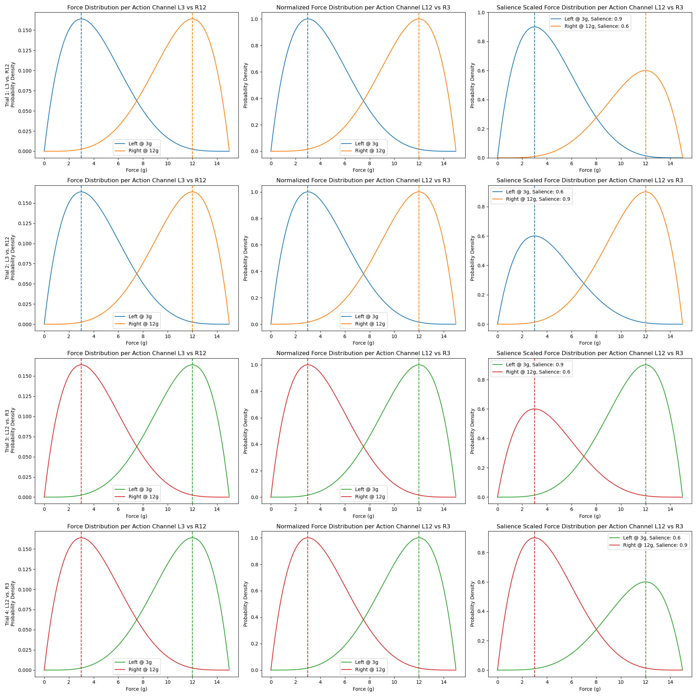
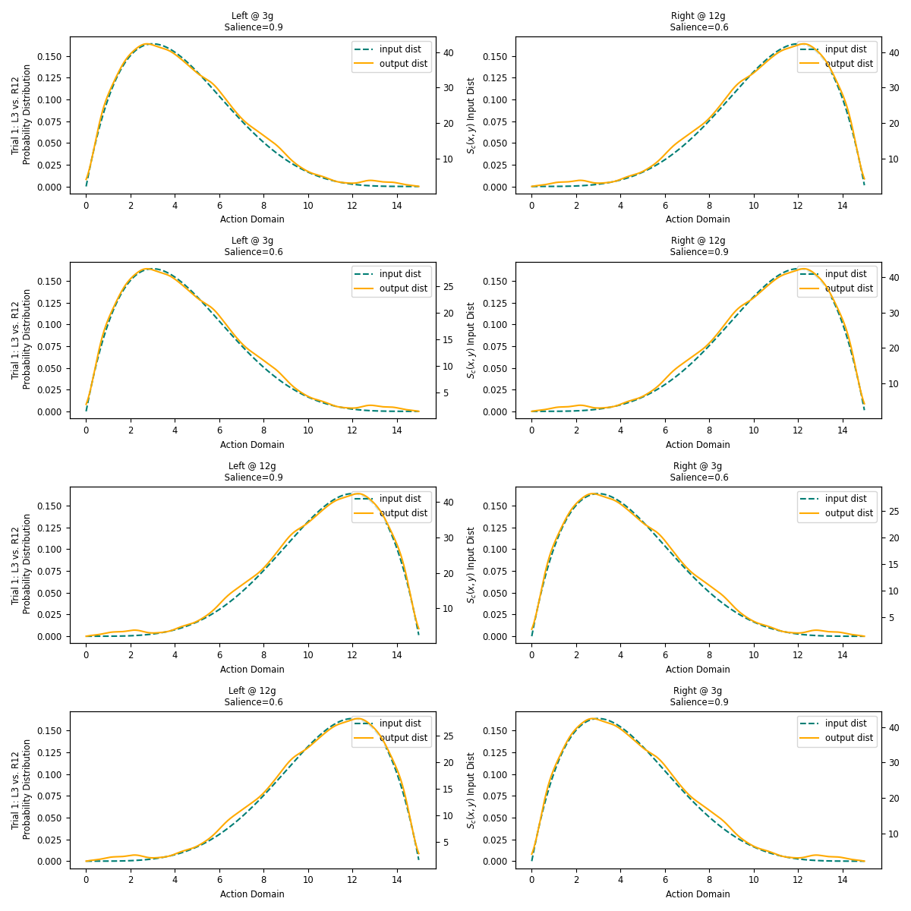
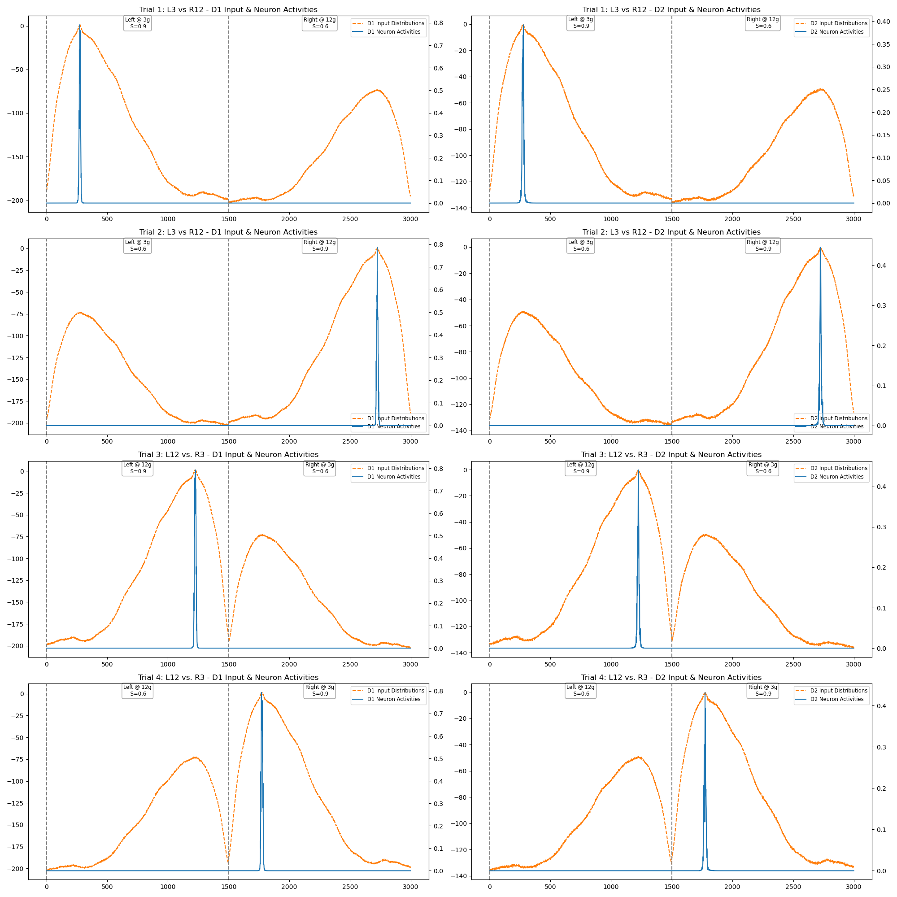
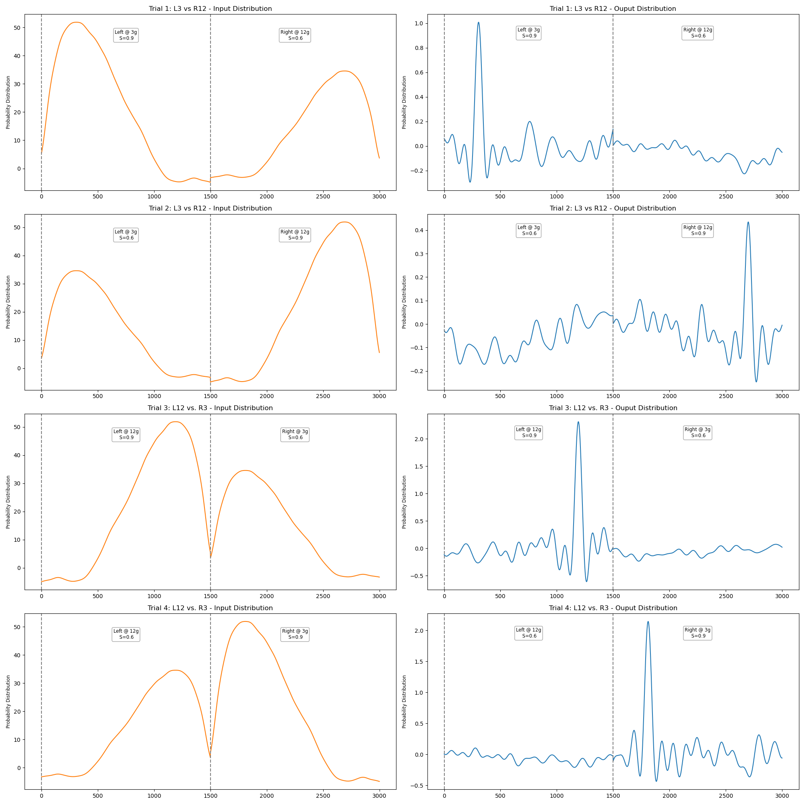
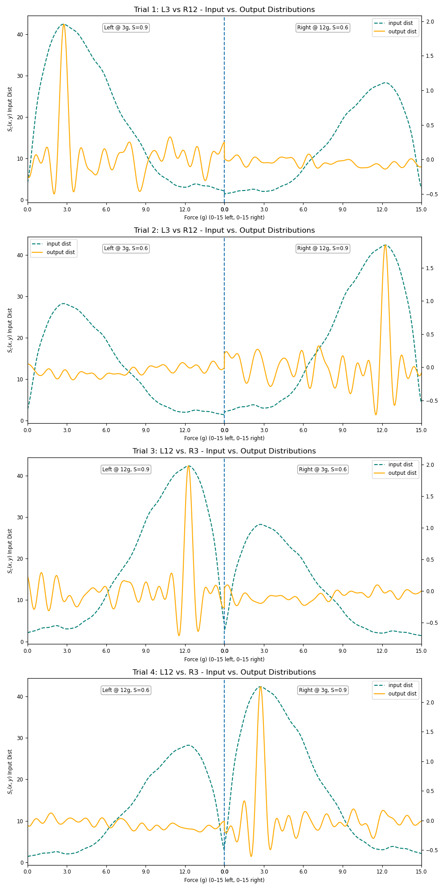

# Park Task (Unimodal) — `park_task.ipynb`

This notebook runs the Park Task with **unimodal** Beta distributions — one clean peak per action channel. It is the baseline version of the experiment; the bimodal variant is in [`park_bimodal.ipynb`](park_task.md).

---

## Task Description

Two discrete motor actions compete over a continuous force domain `[0, 15]g`:

| Action | Discrete component | Continuous parameter | Peak |
|---|---|---|---|
| **Lever Pull (LP)** | Pull left at +5° yaw | Force | 3g |
| **Button Press (BP)** | Pull right at −15° yaw | Force | 12g |

Each action channel is represented by a single-peaked Beta distribution. Unlike the bimodal task, there is no distributional ambiguity — each channel has one clear mode.

---

## Experimental Design

Same 2×2 factorial structure as the bimodal task, varying salience to control which channel wins:

| Trial | LP salience | BP salience | Expected winner |
|---|---|---|---|
| T1 | High (peak @ 3g) | Low (peak @ 12g) | LP wins @ 3g |
| T2 | Low (peak @ 3g) | High (peak @ 12g) | BP wins @ 12g |
| T3 | High (peak @ 12g) | Low (peak @ 3g) | LP wins @ 12g |
| T4 | Low (peak @ 12g) | High (peak @ 3g) | BP wins @ 3g |

---

## Step-by-Step Walkthrough

### 1. Domain & SSP Encoder

```python
n_actions_park = 2
domain_force_park = np.arange(0, 15, 0.01).reshape(-1, 1)  # 1500 points over [0, 15]g
ssp_dim_park = 512

ssp_encoder_park = RandomSSPSpace(
    domain_dim=1,
    ssp_dim=ssp_dim_park,
    rng=np.random.RandomState(0),
    length_scale=0.5
)
domain_phis_park = ssp_encoder_park.encode(domain_force_park)  # Shape: (1500, 512)
```

Identical to the bimodal notebook. The random seed is fixed at `0`.

---

### 2. Unimodal Beta Distributions

Each channel gets one Beta PDF — one peak, no mixing:

- **Lever Pull (LP)**: Beta distribution peaking at 3g
- **Button Press (BP)**: Beta distribution peaking at 12g

```python
# Example: distributions are single-peaked and scaled by salience
dist_lp = beta.pdf(domain_force_park, a_lp, b_lp, scale=domain_force_park[-1])
dist_bp = beta.pdf(domain_force_park, a_bp, b_bp, scale=domain_force_park[-1])
```

Distributions are normalized and scaled by salience before encoding, using the same `Utility.to_normalize()` and `Utility.to_scale()` pipeline as the base BG demo. No call to `Utility.to_bimodal()`.



---

### 3. Running Trials

The same `trial()` helper wraps `BasalGanglia`:

```python
def trial(bundles, n_actions, dnf_parameters, encoders,
          ssp_size=512, d1_weight=1.0, d2_weight=1.0, dopamine_level=0.2):
    bg_model = BasalGanglia(
        n_actions=n_actions,
        dnf_parameters=dnf_parameters,
        encoders=encoders,
        dnf_neurons=1500          # matches domain size (1500 points)
    )
    data = bg_model.simulate(
        input_bundles=bundles,
        dopamine_level=dopamine_level,
        presentation_time=1.5,
        duration=1.5
    )
    return data
```

Note: `dnf_neurons=1500` here (vs. 400 in the base BG demo) to match the finer force domain resolution.

Four trials are run with the same salience schedule as the bimodal task.

---

## Plots

### Input Bundle Plots vs. Original Beta Distributions

`plot_input_bundles()` shows one row per trial, one panel per channel. Each panel overlays:
- **Teal dashed**: original Beta distribution.
- **Orange solid**: decoded SSP bundle from `data['bundle_ins']`.



---

### D1 & D2 DNF Activity (`4×2 grid`)

Rows = trials, columns = D1 and D2 pathways. Plots show neuron activities across both action channel neurons concatenated. The winning channel should produce a sharper peak; the losing channel should be suppressed.



---

### Input vs. Output Distributions (`4×2 grid`)

Decoded input and output SSPs on twin y-axes for each trial and channel:

```python
bin_dist = np.einsum('d,nd->n', data['bundle_ins'][i][-1], domain_phis_park)
bout_dist = np.einsum('d,nd->n', data['bundle_out'][-1][i*512:(i+1)*512], domain_phis_park)
```



---

### Combined Visualisation (`4×1 grid`)

All four trials stacked in a single figure. Each row shows the concatenated LP + BP distributions at input (teal) and output (orange), with custom x-axis ticks mapping neuron index back to the force domain `[0, 15]g`:

```python
N = domain_force_park.shape[0]   # 1500
ticks  = np.linspace(0, N, 6).astype(int)
labels = np.linspace(0, 15, 6).round(1)
```


